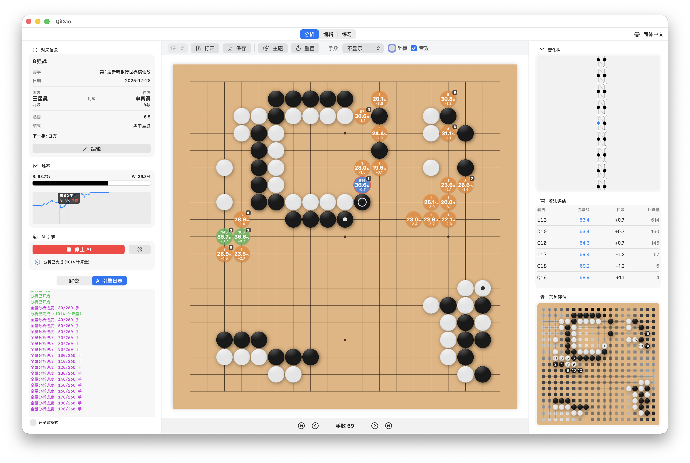
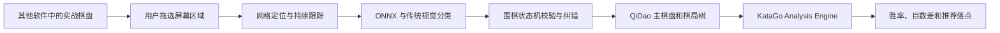

# QiDao 棋道 · 实时对弈分析增强版

> macOS 原生围棋研究工具：屏幕棋盘识别 + QiDao + 本地 KataGo

本仓库在开源项目 [neolee/qidao](https://github.com/neolee/qidao) 的基础上继续开发，保留 QiDao 原有的分析、编辑、练习、SGF、变化树和 KataGo 功能，并新增一个与“分析 / 编辑 / 练习”同级的顶层工作区：**实时对弈分析**。

实时对弈分析允许用户框选另一个软件中正在显示的围棋棋盘。QiDao 会在本机持续读取该区域，识别当前棋局和后续每一手，把经过围棋规则校验的局面同步到主棋盘，再复用 QiDao 原有的 KataGo Analysis Engine 显示最佳落点、候选变化、胜率和目数差。

本功能不会连接星阵、腾讯围棋或其他对弈平台的私有接口，也不会替用户点击或落子；除启动权限探测外，完整棋盘仅在用户框选后采集，并在本地给出分析结果。

## 与原版 QiDao 的关系

原始项目：[`neolee/qidao`](https://github.com/neolee/qidao)

本仓库：[`zxlishixian/qidao`](https://github.com/zxlishixian/qidao)

本仓库属于 QiDao 的非官方增强版本，目前并不是原作者发布的官方版本，也尚未合并到上游项目。项目继续沿用原版 QiDao 的名称、SwiftUI 界面、Rust 核心、SGF 管理、棋盘渲染和 KataGo 分析架构。

在上游功能之上，本仓库主要增加了：

- “实时对弈分析”顶层工作区。
- macOS 屏幕区域框选和持续采集。
- 9、13、19 路棋盘定位与轻微移动跟踪。
- YOLO 风格 ONNX 棋盘粗定位校验。
- ONNX 交叉点黑棋、白棋、空点分类。
- 传统视觉与 ONNX 结果交叉复核。
- 围棋合法性、轮次、提子和重复局面状态机。
- 错误识别后的全盘重新识别和局面恢复。
- 识别棋局自动写入 QiDao 主棋盘并触发 KataGo 重分析。
- 实战棋盘上的虚线跟踪框、最新落子和推荐落点提示。
- 面向屏幕识别链路的 Python、Swift 冒烟测试与诊断工具。

实时对弈分析在界面上是独立工作区，但内部仍使用 QiDao 的 `.analysis` 模式、同一份棋局树和同一个 KataGo 数据源，因此不是另一个独立应用，也不会创建第二套分析棋盘。

原项目和本仓库均依据 [MIT License](LICENSE.md) 开放源代码。原始项目版权归 Neo Lee 所有；本仓库新增部分作为基于原项目的修改和扩展发布。第三方组件和模型仍分别受其自身许可证约束。

## 发布状态

本仓库的 GitHub Actions 只验证可公开源码，包括仓库内容、Python 视觉测试、Rust 核心和 Swift 信任边界。源码 CI 与生产发布完全分离：CI 不读取签名或公证密钥，也不签名、公证、生成 appcast 或创建 Release。

当前仓库不提供官方签名 DMG，也未启用自动更新。用户可以按下文自行构建，或等待维护者建立 fork 专用的签名、公证和受保护发布体系后再使用官方发布包。

## 功能概览

### 原版 QiDao 功能

- 19 × 19、13 × 13、9 × 9 棋盘。
- SGF 打开、保存、局面信息和注释。
- 图形化变化树及分支浏览。
- KataGo Analysis API 实时分析。
- 候选点、胜率、目数差、后续变化和领地图。
- 自由摆子、标记和棋谱编辑。
- 与 AI 练习对局。
- 木质、黑白印刷棋盘主题以及中英文界面。



### 实时对弈分析

- 像截图工具一样拖选完整棋盘，不需要点四个角。
- 首次识别后自动复制整个棋局，而不是只记录后续落子。
- 持续扫描双方每一手，不需要每手点击“重新识别”。
- 棋盘窗口轻微移动时自动跟踪和校正虚线框。
- 识别单手变化、多手漏检、提子、停一手和轮次修正。
- 局面不一致时可以直接重建为真实棋盘，而不是只能继续追加着法。
- 鼠标悬停棋子虚影经过稳定帧和状态机过滤。
- QiDao 不在前台时仍继续采集、同步和刷新分析。
- 可手动重新识别当前棋盘、重新框选、撤销识别、记录停一手和刷新 AI。

## 工作原理



视觉链路分为以下几层：

1. 在用户选择区域内拟合完整棋盘网格，确定最外侧交叉点。
2. 使用轻量棋盘定位 ONNX 模型对网格结果做粗框校验。
3. 对棋盘做透视归一化，消除窗口尺寸、Retina 缩放和轻微透视影响。
4. 批量分类所有交叉点为 `empty / black / white / unknown`。
5. 使用传统色彩、圆周和几何特征复核红点、棋子边缘和模型不确定点。
6. 通过围棋状态机验证落子颜色、轮次、气、提子和重复局面。
7. 将确认局面作为一个完整事务写入 QiDao，再请求 KataGo 分析。

更详细的模型、训练数据和指标说明见 [vision/README.md](vision/README.md)。

## 系统要求

- Apple Silicon Mac，建议 M1 或更新机型。
- macOS 14 Sonoma 或更高版本。
- Xcode Command Line Tools；开发环境建议 Xcode 16 或更新版本。
- 可创建虚拟环境并安装依赖的 Python 3.12 或更新版本。
- 通过 rustup 安装的 Rust 1.97.1 和 Cargo；项目由 `rust-toolchain.toml` 固定该版本。
- KataGo 可执行程序。
- 首次运行实时识别需要授予“屏幕录制”权限。

`build_app.command` 面向 arm64 和 macOS 14，并通过 `xcrun --sdk macosx --show-sdk-path` 使用当前安装的 macOS SDK。

## 快速安装

### 1. 克隆项目

```bash
git clone https://github.com/zxlishixian/qidao.git
cd qidao
```

如果项目已经位于其他目录，直接在项目根目录继续以下步骤即可。

### 2. 安装基础工具

安装 Xcode Command Line Tools：

```bash
xcode-select --install
```

从 [rustup 官方网站](https://rustup.rs/) 安装 rustup，然后安装并检查本项目固定的 Rust/Cargo 工具链：

```bash
rustup toolchain install 1.97.1 --profile minimal --component rustfmt
rustc --version
cargo --version
```

使用 Homebrew 或 KataGo 官方发行版安装 KataGo 可执行程序。使用 Homebrew 时可以执行：

```bash
brew install katago
```

也可以使用 KataGo 官方发行版中的可执行程序。

### 3. 创建稳定的本地签名

```bash
chmod +x setup_signing.command setup.command build_app.command build_vision.sh
./setup_signing.command
```

**运行前请注意持久系统变更：** 脚本会创建一个十年有效、自签名且带 `CA:TRUE` / `keyCertSign` 的代码签名证书，将 `.signing/QiDaoLocal.keychain-db` 加入当前用户钥匙串搜索列表，并在该专用钥匙串中把证书设为 `trustRoot`。这些变更在脚本退出和仓库关闭后仍然存在。脚本不会修改系统钥匙串，但只有接受这些本机开发签名变更时才应运行。

该身份使后续重新构建继续使用同一签名，可以减少 macOS 因应用身份变化而反复要求录屏授权的问题。

`.signing/` 包含本机私有钥匙串和密码，已经被 `.gitignore` 排除。不要把它提交到 Git、发送给他人或放入公开发布包。

如需撤销，先在仓库根目录执行以下命令。它从用户搜索列表移除 QiDao 钥匙串，删除包含该信任根和私钥的专用钥匙串，再移除本地密码文件；之后重建的应用会失去原签名身份，并可能需要重新授予屏幕录制权限。

<!-- signing-cleanup-start -->
```bash
set -euo pipefail
keychain="$PWD/.signing/QiDaoLocal.keychain-db"
if [ ! -f "$keychain" ]; then
    echo "QiDao local signing keychain does not exist: $keychain" >&2
    exit 1
fi

certificate_file=$(mktemp /private/tmp/qidao-signing-cert.XXXXXX)
trap 'rm -f "$certificate_file"' EXIT
if security find-certificate -c "QiDao Local Code Signing" -p "$keychain" > "$certificate_file"; then
    # No -d: setup_signing.command created a user trust setting, not admin trust.
    security remove-trusted-cert "$certificate_file"
else
    echo "QiDao signing certificate is already absent; continuing with keychain removal."
fi

kept_keychains=()
while IFS= read -r line; do
    item="${line//\"/}"
    item="${item#"${item%%[![:space:]]*}"}"
    if [ -n "$item" ] && [ "$item" != "$keychain" ]; then
        kept_keychains+=("$item")
    fi
done < <(security list-keychains -d user)
security list-keychains -d user -s "${kept_keychains[@]}"
security delete-keychain "$keychain"
rm -f "$PWD/.signing/keychain-password"
rmdir "$PWD/.signing"
```
<!-- signing-cleanup-end -->

### 4. 安装视觉依赖并构建

```bash
./setup.command
```

该脚本会：

1. 在仓库根目录创建或复用 `.venv`。
2. 安装 NumPy、OpenCV Headless 和 Pillow。
3. 检查 KataGo 是否可用。
4. 调用 `build_core.sh` 生成 Rust Core 和 Swift 绑定。
5. 调用 `build_app.command` 生成签名后的应用。

例如仓库位于：

```text
$HOME/code/qidao
```

视觉 Python 环境会位于：

```text
$HOME/code/qidao/.venv
```

这是当前脚本的既定目录布局。移动或复制仓库以后必须在新目录重新运行 `./setup.command`，以便为该仓库安装 OpenCV 运行环境。

构建完成后应用位于：

```text
.build/QiDao.app
```

### 5. 启动应用

```bash
open .build/QiDao.app
```

也可以在 Finder 中双击 `.build/QiDao.app`。

## 首次配置

### 录屏权限

1. 启动 QiDao。
2. 切换到顶部的“实时对弈分析”。
3. 点击“请求权限”或“打开设置”。
4. 在“系统设置 → 隐私与安全性 → 屏幕录制”中启用 QiDao。
5. 完全退出 QiDao 后重新打开。

服务启动时会使用同一个签名 helper 读取 8×8 像素做权限可用性探测，像素不落盘、不上传；除启动权限探测外，完整棋盘仅在用户框选后采集。截图和棋局状态默认只在本机内存中处理，不会上传到本项目维护者或第三方服务器。

界面显示“录屏权限已生效”只代表主应用已经获得系统权限；如果点击开始后视觉服务仍立即退出，请优先检查 Python/OpenCV 环境，参见后文“故障排查”。

### KataGo 引擎

1. 使用 Homebrew 或 KataGo 官方发行版安装可执行程序。
2. 从 KataGo 官方网络页面下载与设备兼容的 `.bin.gz` 权重。
3. 在 QiDao → AI 引擎设置中分别选择可执行程序、权重和 `analysis.cfg`。
4. 未配置权重时，棋谱编辑和屏幕识别仍可用，AI 分析保持未配置状态。
5. 两个 ONNX 是本项目用合成数据从随机初始化训练的 MIT 发布资产。

在左侧“AI 引擎”区域点击齿轮，新建或编辑一个 Engine Profile，然后设置以下路径：

   - **Path**：KataGo 可执行程序，例如 `which katago` 返回的路径。
   - **Model**：KataGo `.bin.gz` 权重文件。
   - **Config**：用于 Analysis API 的 `analysis.cfg`，不要选择 `gtp.cfg`。
   - **Extra Args**：通常留空。

本地构建会把仓库中的 `analysis.cfg` 复制到：

```text
.build/QiDao.app/Contents/Resources/katago/analysis.cfg
```

源码发布不附带 KataGo 可执行程序或网络权重，用户需要自行安装和选择。用户将可选的 `katago/default_model.bin.gz` 放入本地仓库后，`build_app.command` 会把该权重打包进本地构建的应用资源；文件不存在时，应用不打包权重，仍可在 AI 引擎设置中选择用户下载的模型。下载网络权重请使用 [KataGo 官方网络页面](https://katagotraining.org/networks/)。

如果曾经移动过项目目录，旧的 Engine Profile 可能仍保存旧应用包的绝对路径。请在齿轮设置中把 Model 和 Config 改为新目录下的资源路径，然后停止并重新启动 AI。

## 使用实时对弈分析

### 开始识别

1. 在其他软件中打开实际对局，并让完整棋盘保持可见。
2. 打开 QiDao，切换到顶部“实时对弈分析”。
3. 在“识别设置”中选择正确棋盘规格：19 × 19、13 × 13 或 9 × 9。
4. 根据实战棋盘方向选择 `0°` 或 `180°`。
5. 点击“选择棋盘并开始”。
6. 像截图一样按住鼠标拖出矩形，框住完整棋盘网格。
7. 首帧识别完成后，确认 QiDao 主棋盘与真实棋盘一致。
8. 在“下一手”中确认应该由黑方还是白方落子。
9. 启动或保持 AI 引擎运行。

框选时应包含从左上角到右下角的全部最外侧交叉点。坐标文字和棋盘木框可以少量包含，但不要把玩家头像、聊天框、胜率图或大块界面背景放入选择区域。

### 自动跟踪

基准局面确认后，程序会持续扫描：

- 真实棋盘出现新着时，QiDao 自动更新主棋盘。
- 出现提子时，状态机根据围棋规则移除无气棋块。
- 漏掉多手或之前局面错误时，稳定全盘共识会直接重建当前真实局面。
- KataGo 在每次同步完成后重新分析。
- 实战棋盘上显示虚线跟踪框、最新落子和推荐落点提示。

提示圈采用接近棋子大小的虚线圆，旁边保留类似 `K13`、`F4` 的坐标标签。提示只负责指导，用户仍需自行在实战软件中落子。

### 控制按钮

- **暂停跟踪 / 继续跟踪**：临时停止或恢复扫描，保留当前校准和棋局。
- **重新识别棋盘**：沿用当前跟踪框重新采集全盘，并把 QiDao 恢复为确认后的真实局面。
- **重新选择棋盘**：棋盘大幅移动、缩放或切换软件后重新框选。
- **记录停一手**：真实对局发生 Pass 时手动记录，并切换下一手颜色。
- **撤销识别**：撤回最近一次已确认识别。
- **刷新 AI**：棋盘已经同步但 KataGo 未更新时重新请求分析。
- **停止**：结束视觉服务、跟踪和屏幕提示。
- **黑方下 / 白方下**：纠正恢复局面后的下一手颜色。

### 什么时候使用“重新识别”或“重新框选”

优先使用“重新识别棋盘”：

- 个别棋子颜色或位置识别错误。
- 提子后 QiDao 与真实棋盘不一致。
- 鼠标虚影或动画造成了临时误判。
- 漏掉了若干手，需要直接恢复当前完整局面。

只有以下情况才需要“重新选择棋盘”：

- 棋盘窗口发生大幅移动或缩放。
- 切换到另一个围棋软件或另一块棋盘。
- 原选择区域没有包含完整外侧网格。
- 跟踪框长期明显偏离真实棋盘。

## 提高识别稳定性的建议

- 框选前确认棋盘规格和方向正确。
- 首次识别时让棋盘保持静止一到两秒。
- 尽量完整显示棋盘，不要让窗口边缘裁掉外侧交叉点。
- 避免聊天窗口、菜单、鼠标指针或其他窗口遮挡棋盘。
- 落子后把鼠标移出棋盘，虽然状态机能够过滤多数半透明虚影。
- 不要在识别过程中快速连续拖动或缩放目标窗口。
- 棋盘主题颜色过暗、过亮或棋子高度透明时，可先提高目标软件的对比度。
- 当真实棋局和 QiDao 明显不一致时，立即使用“重新识别棋盘”，不要继续在错误局面上分析。

## 故障排查

### 点击“选择棋盘并开始”后没有反应或服务退出

仓库移动后最常见原因是仓库内的 `.venv` 缺少 OpenCV。重新执行：

```bash
cd /path/to/qidao
./setup.command
```

也可以检查视觉依赖：

```bash
.venv/bin/python -c "import cv2, numpy, PIL; print('vision runtime ok')"
```

如果出现 `ModuleNotFoundError: No module named 'cv2'`，说明尚未在新目录对应的环境安装 `vision/requirements.txt`。

### 一直提示需要录屏权限

1. 在系统设置中关闭再重新开启 QiDao 的屏幕录制权限。
2. 完全退出应用，不只是关闭窗口。
3. 从同一个 `.build/QiDao.app` 重新启动。
4. 不要删除 `.signing/` 后反复创建不同本地签名。

### KataGo 无法启动

检查：

```bash
which katago
katago version
```

确认 Engine Profile 中：

- Path 指向可执行的 KataGo。
- Model 指向存在的 `.bin.gz` 文件。
- Config 指向 `analysis.cfg`。
- 路径没有残留旧项目目录。

### 项目移动后 AI 仍读取旧目录

QiDao 的 Engine Profile 保存在 macOS `UserDefaults` 中，不会因为仓库移动自动改写仍然存在的旧文件路径。在 AI 齿轮设置中选择新应用包里的 Model 和 Config，保存后重新启动 AI。

### 棋盘可以识别，但没有同步到主棋盘

- 确认顶部处于“实时对弈分析”工作区。
- 检查状态是否为 `LIVE`，而不是暂停或恢复中。
- 检查黑白下一手是否正确。
- 点击“重新识别棋盘”建立新的全盘共识。
- 如果跟踪框已经偏离，使用“重新选择棋盘”。

### 棋盘更新了，但 AI 没有新结果

- 确认 AI 引擎处于运行状态。
- 点击“刷新 AI”。
- 打开“AI 引擎日志”查看 KataGo 路径、模型或配置错误。
- 适当降低 `maxVisits`，可以缩短每次分析等待时间。

### 构建提示缺少签名身份

执行：

```bash
./setup_signing.command
./build_app.command
```

不要把其他机器的 `.signing/` 直接作为公共仓库内容分发。

## 手动构建与开发

普通本地重建：

```bash
./build_app.command
```

只重建原生屏幕采集辅助程序：

```bash
./build_vision.sh
```

修改 `qidao-core/` 后重新生成 Rust 静态库和 Swift UniFFI 绑定：

```bash
./build_core.sh
```

开发 Rust 核心使用项目固定的 Rust 1.97.1 toolchain：

```bash
rustup toolchain install 1.97.1 --profile minimal --component rustfmt
cd qidao-core
cargo test --locked
```

不要直接修改 `QiDao/QiDao/Core/` 下由 UniFFI 生成的文件；应修改 `qidao-core/` 后运行 `build_core.sh`。

### 测试视觉链路

```bash
PYTHONPATH=vision .venv/bin/python -m unittest discover -s vision/tests -v
```

测试覆盖：

- 空盘与非空局面初始化。
- 单手和连续多手自动同步。
- 提子和无气棋块清除。
- 鼠标悬停虚影过滤。
- 错误局面全盘恢复。
- 下一手颜色修正。
- 棋盘移动、漂移和重新定位。
- QiDao 应用确认与视觉服务重发机制。
- JSON Lines 服务协议。

Swift 侧还提供以下回归工具：

- `tools/smoke_live_board_refresh.swift`
- `tools/smoke_ai_live_start.swift`
- `tools/smoke_window_layout.swift`
- `tools/smoke_katago.py`
- `tools/diagnose_real_frame.py`

### 重新训练视觉模型

运行时不需要 PyTorch。只有重新训练模型时才需要创建 `.venv-train/` 并安装 `vision/requirements-training.txt`。完整命令、训练集生成方法、评测指标和模型 SHA-256 见 [vision/README.md](vision/README.md)。

## 项目结构

```text
qidao/
├── QiDao/                         # SwiftUI 客户端和 Xcode 工程
│   └── QiDao/
│       ├── ScreenAssistManager.swift
│       ├── ScreenAssistView.swift
│       └── BoardViewModel+ScreenAssist.swift
├── qidao-core/                    # Rust 围棋规则、SGF 和引擎通信核心
├── vision/                        # 视觉服务、状态机、ONNX 模型和测试
│   ├── go_vision/
│   ├── models/
│   ├── native/
│   └── tests/
├── katago/                        # Analysis 配置与网络权重下载说明
├── resources/                     # 截图、音效、示例棋谱和参考文档
├── tools/                         # 诊断和回归测试工具
├── app/Info.plist                 # 本地 Swift 编译应用的 Info.plist
├── setup.command                  # 安装视觉运行依赖并构建
├── setup_signing.command          # 创建稳定的本地签名
├── build_app.command              # 组装并签名 .build/QiDao.app
├── build_vision.sh                # 编译原生屏幕采集辅助程序
└── build_core.sh                  # 构建 Rust 核心和 UniFFI 绑定
```

以下目录属于本地生成内容，不应提交：

- `.build/`
- `.signing/`
- `.artifacts/`
- `.venv-train/`
- `__pycache__/`
- Xcode `DerivedData/`

## 隐私与使用边界

- 识别和 KataGo 分析均在本机完成。
- 除启动权限探测外，完整棋盘仅在用户框选后采集。
- 程序不读取第三方平台账号、网络协议或聊天内容。
- 程序不会自动点击第三方软件，也不会代替用户落子。
- 屏幕识别可能出现误判，重要对局中应以真实棋盘为准。
- 请遵守所使用围棋平台、比赛和赛事的规则；在禁止 AI 辅助的对局中不要启用实时分析。

## 已知限制

- 当前仅支持 Apple Silicon 和 macOS 14+。
- 支持 9、13、19 路标准方形棋盘，不支持任意路数。
- 棋盘被严重遮挡、裁切或透视变形时可能无法稳定定位。
- 极端主题、动态特效和高度透明棋子可能降低分类准确率。
- Pass 无法仅通过棋盘画面观察，需要手动点击“记录停一手”。
- KataGo 速度取决于模型、设备性能和 `maxVisits` 设置。
- 本地构建签名仅用于开发和保持本机录屏授权，不等同于 Apple Developer ID 公证发布。

## 开源贡献

如果准备把功能贡献回原项目，建议先在 [`neolee/qidao`](https://github.com/neolee/qidao) 创建 Issue，说明实时对弈分析的设计、演示、测试和模型来源，再根据维护者意见拆分 Pull Request。

提交代码前请确认：

- 分支基于上游 `main`，不是无共同历史的独立仓库快照。
- 不包含 `.signing/`、`.build/`、本机绝对路径或个人数据。
- 不包含 KataGo 网络权重；用户应从官方页面自行下载。
- ONNX 模型的训练数据、许可证和复现流程有明确说明。
- Swift、Rust 和视觉测试通过。
- 保留原项目版权和 MIT License。

## 致谢

- [Neo Lee / QiDao](https://github.com/neolee/qidao)：本项目的原始框架、产品设计和主要实现。
- [KataGo](https://github.com/lightvector/KataGo)：本地围棋 AI 引擎。
- [LizzieYzy](https://github.com/yzyray/lizzieyzy)：围棋 GUI 和分析交互的重要参考。
- 所有为围棋规则、计算机视觉、ONNX、OpenCV、Swift 和 Rust 生态作出贡献的开发者。

## 许可证

项目主体沿用 [MIT License](LICENSE.md)。KataGo、网络权重以及其他第三方资源的许可信息请分别查看 [THIRD_PARTY_NOTICES.md](THIRD_PARTY_NOTICES.md) 和 [katago/NETWORK_LICENSE.md](katago/NETWORK_LICENSE.md)。
